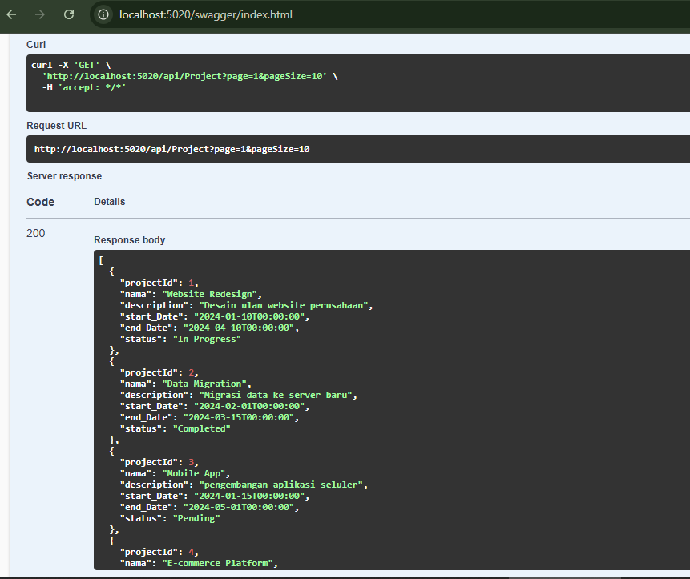

# Backend API - PostgreSQL with .NET 8

## 📋 Project Overview
This project is a backend API built with .NET 8 and PostgreSQL. It serves as a portfolio example showcasing CRUD operations, authentication, and API endpoint creation. you can access fo [Frontend](https://github.com/tkarombang/Frontend_TS_Fullstack) 

---

## 🛠️ Technologies Used
- **Framework:** .NET 8
- **Database:** PostgreSQL
- **Tools:** Visual Studio Code, Postman, Docker (optional)

---

## 🚀 Getting Started

### Prerequisites
1. **.NET SDK 8** - Download and install from [dotnet.microsoft.com](https://dotnet.microsoft.com/).
2. **PostgreSQL** - Download and install from [postgresql.org](https://www.postgresql.org/).
3. **IDE (e.g., Visual Studio) or Visual Studio Code with Extension (C#-.NET Install Tool, C# Dev Kit)**.
4. **Postman** (optional for testing).

### Installation Steps
1. **Clone the Repository:**
   ```bash
   git clone https://github.com/tkarombang/Backend_API-PostgreSQL_Withdotnet-8.git
   cd yourrepository
   ```

2. **Set Up PostgreSQL Database:**
   - Create a new PostgreSQL database.
   - Update the `appsettings.json` file:
     ```json
     {
       "ConnectionStrings": {
         "DefaultConnection": "Host=localhost;Database=sampledb;Username=postgres;Password=admin"
       }
     }
     ```

3. **Run Migrations:**
   ```bash
   dotnet ef database update
   ```

4. **Run the Application:**
   ```bash
   dotnet run
   ```

---

## 📚 Project Structure
```
|-- YourProjectName
    |-- Controllers
    |-- Data
    |-- Migration
    |-- Model
    |-- appsettings.json
    |-- Program.cs
    |-- Startup.cs
```

---

## 📋 API Endpoints
### Authentication
- **POST** `/api/auth/register` - Register a new user
- **POST** `/api/auth/login` - Authenticate a user

### CRUD Operations
- **GET** `/api/items` - Retrieve all items
- **GET** `/api/items/{id}` - Retrieve a specific item
- **POST** `/api/items` - Add a new item
- **PUT** `/api/items/{id}` - Update an existing item
- **DELETE** `/api/items/{id}` - Delete an item

---

## 🧪 Testing
- Use Postman to test API endpoints.
- Check logs in the console for debugging.

---

## 📄 API Documentation with Swagger
- **Swagger Integration:**
  - Swagger provides a user-friendly interface to explore and test API endpoints.
  - After running the application, access Swagger UI at:
    ```
    http://localhost:5020/swagger
    ```
  - It automatically generates interactive API documentation based on your code annotations.

---

## Swagger API Response
We're using Swagger to documnet this API. Here's an example of what you'll get when you request a list of projects.

After running dotnet run in the terminal, please access the URL in your browser's address tab as shown  in the image below


### Contoh Respons
Respons API mengembalikan data proyek dalam format JSON, yang berisi informasi seperti:
- `projectId`: ID proyek
- `nama`: Nama proyek
- `description`: Deskripsi proyek
- `start_Date`: Tanggal mulai proyek
- `end_Date`: Tanggal selesai proyek
- `status`: Status proyek

Berikut adalah contoh respons JSON:
```json
[
  {
    "projectId": 1,
    "nama": "Website Redesign",
    "description": "Desain ulang website perusahaan",
    "start_Date": "2024-01-10T00:00:00",
    "end_Date": "2024-04-10T00:00:00",
    "status": "In Progress"
  },
]
```
---

## 🤝 Contributions
1. Fork the repository.
2. Create a feature branch.
3. Commit your changes.
4. Open a pull request.

---

## 🧑‍💻 Author
**Muhammad Azwar Anas** - [LinkedIn](https://linkedin.com/in/muhanaz) | [GitHub](https://github.com/tkarombang)

